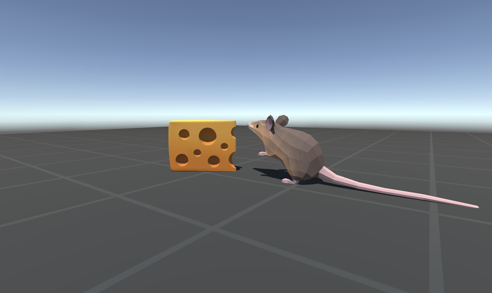

# A.I. Mouse collects Cheese

*Built with Unity ML-Agents*

### Description

This is a simple introduction project made for those wanting to learn the ML-Agents framework. If you are looking for a quick way to get started with Machine Learning, this project was made for you!

**The Game**: A mouse trained with Machine Learning tries to collect cheese that is spawned randomly on a plattform.

### Built with

- Unity 2018.4.14f1 (LTS)

- ML-Agents 0.13.1

### Credits

Thanks to Google Poly for the 3D models. Thanks to Unity3D for a great engine and great framework. 

